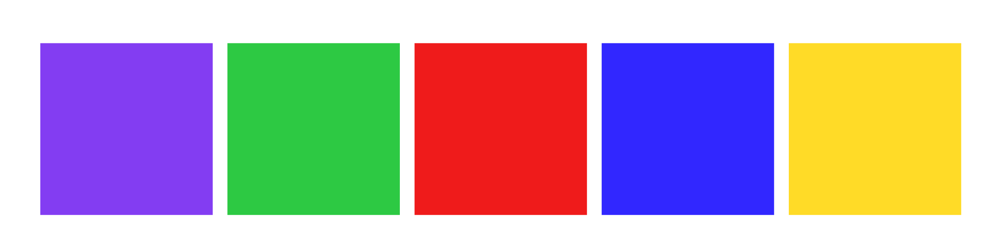
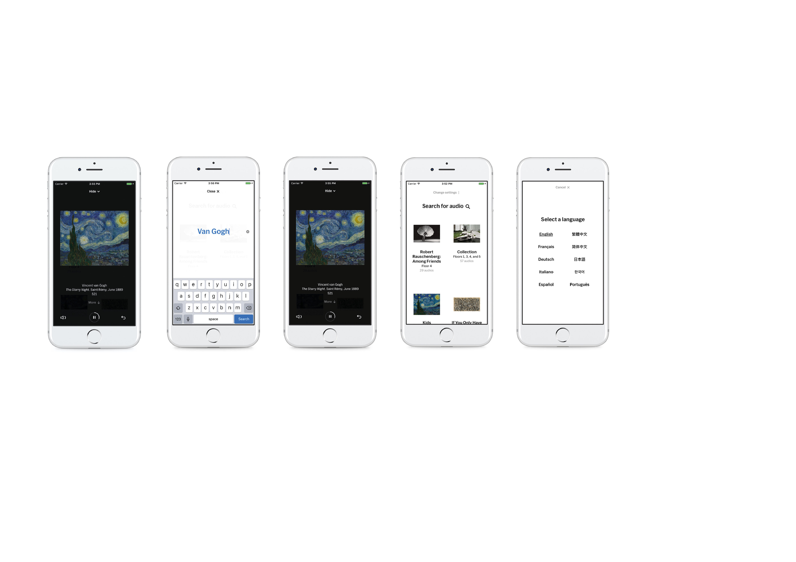

### MAPSTRACT - Creative Coding 2019-2020 - Group 6

<ol>
  <li> Scenario </li>
  <li> Aim of the project </li>
  <li> Idea and concept </li>
  <li> Details </li>
  <li> Technologies and libraries </li>
  <li> Code challenges </li>
  <li> Visual </li>
  <li> Inspiraton and references </li>
  <li> Interactions </li>
  <li> Course details </li>
  <li> Developers </li>
</ol>

  ### Scenario
  The app is developed for museums which want to organize events for the arrival of a new painting, or for the opening of a new exhibition; in this case, our app could be used by the *Museo del Novecento* in Milan for a temporary event organized for the arrival of a new Pollock piece in the museum. The app can be used everywhere in Milan (for now). 

For the first version of the app, we decided to limit the gameplay range in the city of Milan and the main theme of the app is Pollock. 
We thought that the app could be declined in various artists’ styles depending on new arrivals of works of art in the museum.

We decided to develop Pollock as the first modality since, recalling its style, it leaves the user a lot of freedom to express his creativity through free paths and colors. 
</br>
</br>
### Aim of the project
The aim of the project is to allow people to keep in touch with art while having fun while walking and cycling. It’s an original way to promote art and to advertise the Museo del Novecento. Museums often do not place themselves in a direct way towards users; therefore, it follows that only a few fans remain in contact with the news and events organized by the museum. 
</br>
</br>
### Idea and concept
Since the brief of the project was to create something collaborative, the first thing that came into our mind was to develope an app that would link art and people. 

We also thought that GPS based apps are so popular nowadays (we can think about "Pokémon Go" or "Strava"), and they are easy and fun to use; GPS based games promote a way of playing that differs from the use of the classic consoles connected to the TVs: GPS games promote outdoor playing.

It’s also a recent trend for museums all over the world to develop apps for their visitors to make their visit an interactive experience. 
</br>
</br>
### Details
The user, in this version of the app, can open up the website and leave a track behind himself. The track is registered by the server and sent to a general map, which collect all the peoples tracks around the city, creating a drawing similar to the artists' styles (in this case, Pollock). To bring examples of other artists, we could have shapes like circles, squares and triangles for Kandinskij, or a grid filled up with squares for Mondrian.

For this first version of the app, people can choose among a range of five colours, which can be selected on the right side of the map page. The user can reach that page from the homepage. After choosing the color, a dot will appear on the map, in the user location; then the user can walk around and leave a track! When he is satisfied with the drawing that he made, another button will send the user to the results page, where the whole city map can be seen with all the drawings of all the users that ever connected to the website.
</br>
</br>
### Technologies and libraries
**GPS**</br>
Thanks to the GPS location collection, it is possible to register the drawings on the map.</br>
**Mapbox**</br>
Mapbox is a tool which can be used to create maps for web-apps. </br>
**p5.js**</br>
The javascript library p5 allows to write the code in a simple, yet creative way.</br>
**Firebase**</br>
Firebase is a website that works as a bridge between pages of the app and lets the app collect data, storing them in an online server.</br>
**JavaScript & Html**</br>
</br>
### Code challenges
**Basic canvas structure (map)**</br>
We had to set up the main canvas of the tracking page, where the user can walk around, and the results page: we used MapBox to set up a map, and it wasn’t easy to set it up properly. We wanted to have an interactive map, but, with our own knowledge, we couldn’t merge the interactive map with the drawing canvas; moving the map around would have left a track on the canvas, ruining the experience. We looked everywhere for a solution to this problem, but, in the end, we couldn’t find one. That’s why we choose to lock the zoom and the viewport, and we tried to go that way.

We first loaded what we needed in the index:</br>
 ``` ruby
    <script src="p5.geolocation.js"></script>
    <script src="https://unpkg.com/mappa-mundi/dist/mappa.js" type="text/javascript"></script>
 ```
</br>
Then in the sketch we overlayed the map over the canvas:</br>
 
 
  ``` ruby
     myMap = mappa.tileMap(options);
   myMap.overlay(canvas)
 ```
 </br>
</br>
In this way we were able to draw on the canvas over the map. </br>
We needed then to write a dot where the location was represented on the map, representing the user location. But we also needed to collect the location by the user:
</br>

        var point = myMap.latLngToPixel(myLat, myLon)
   
    radius = 15;
    circle(point.x, point.y, radius)
    
    function preload() {
      milano = loadImage("./mappaMilano.png")

     //updates location everytime there's a new one
     position = watchPosition(positionChanged);
     }

    function positionChanged(position) {
     myLat = position.latitude;
      myLon = position.longitude;
      }

</br>
</br>
**Home page functions?**</br>
WRITE HERE ABOUT HOMEPAGE FUNCTIONS
</br>
**Animation**</br>
FIX THIS ABOUT HOMEPAGE ANIMATION
As the first thing of our app, in the homepage we wanted to represent the idea of movement. So we thought about developing an animation that would recall the idea of dynamicity. We made this animation also to represent people walking around, and to give a preview of the web-app itself.
</br>
</br>
### Visual
**Font**</br>

The font used in the app is *IBM plex sans*. </br>
We chose this font due to his spirit and history: IBM Plex was designed to illustrate the unique relationship between mankind and machines. We taught it was perfect for our project, since it connects artists’ souls and style to an app.
</br>
**Colors**</br>
</br>
We used different hues of grey, the light one as a background, and the darker one for details and texts.</br>

***Light Gray***</br>
R: 223 </br>
G: 225 </br>
B: 229 </br>

***Dark Gray***</br>
R: 89 </br>
G: 89 </br>
B: 89</br>
</br>

</br>
We decided to use five different colors: a vibrant green, a vibrant purple and the three primary colors. </br>

***Yellow***</br>
R: 255 </br>
G: 219 </br>
B: 39 </br>

***Blue***</br>
R: 49 </br>
G: 39 </br>
B: 255 </br>

***Red***</br>
R: 239 </br>
G: 27 </br>
B: 27 </br>

***Green***</br>
R: 45 </br>
G: 201 </br>
B: 67 </br>

***Purple***</br>
R: 131 </br>
G: 61 </br>
B: 242 </br>
</br>
### Inspiration and references</br>
Those are the references we used to build up our web-app:
- YouTube channel *[The Coding Train](https://www.youtube.com/channel/UCvjgXvBlbQiydffZU7m1_aw/)*</br>
- [Painted Earth by Moniker Studio](https://studiomoniker.com/projects/painted-earth)</br>
</br>
 [MoMa app by Moma NY](https://apps.apple.com/us/app/moma/id383990455) 
</br>

### Interactions</br>
**Homepage**</br>
The homepage doesn't include any interaction, except for the button that brings the users to the "How to Play" section of the app.</br></br>
**Map page**</br>
The users can choose a color among the selected palette; when they choose it, the circle that indicates their position change color. At this point, they can start walking, moving around the city and leaving a colorful track. At the end, they have to press the button "stop" that is linked to the page that contains the whole map of their city. Here, they can see the track that they have left and also the other users' ones.</br> </br>
**Results page**</br>
The results page, as written before, shows all the drawings left by the users. It's in this section that the users can finally see the main goal of the app: drawing on the city map, making it more colorful. </br>
</br>
### Developers</br>
[Agnese Bartolucci](), [Giulia Proserpio](), [Lorenzo Sala](), [Barbara Vanoli]()

### Course details</br>
**Teacher:** Michele Mauri </br>
**Teaching Assistant:** Andrea Benedetti

This repository is the starting point of the assignments given in the elective course [Creative Coding at Politecnico di Milano](https://www11.ceda.polimi.it/schedaincarico/schedaincarico/controller/scheda_pubblica/SchedaPublic.do?&evn_default=evento&c_classe=696598&__pj0=0&__pj1=3ed8420c42c849845b5caa3de626e8fc).</br>
Browse [this website](https://drawwithcode.github.io/) if you want to know more about it.
